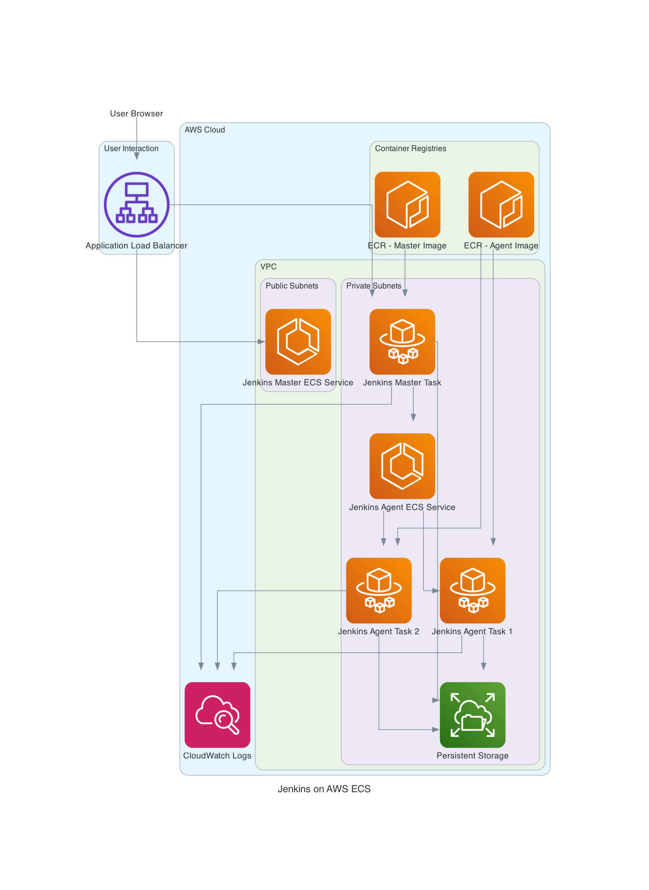

# Jenkins on AWS ECS Flow Diagram

This diagram illustrates the high-level architecture and data flow for Jenkins deployed on AWS ECS.

**Explanation of Flow:**

1.  **User Access**: Users access the Jenkins web interface via their browser, which routes through the **Application Load Balancer (ALB)**.
2.  **Master Service**: The ALB forwards requests to the **Jenkins Master ECS Service**, which manages the **Jenkins Master Task** running on Fargate.
3.  **Agent Connection**: The Jenkins Master Task communicates with the **Jenkins Agent ECS Service** to provision and manage **Jenkins Agent Tasks** (multiple agents can run concurrently).
4.  **JNLP Communication**: Agents establish a connection back to the Master using the JNLP protocol, typically over port 50000, for command and control.
5.  **Persistent Storage**: Both Master and Agent tasks utilize **EFS (Elastic File System)** for persistent storage of Jenkins data, ensuring data integrity and availability.
6.  **Image Sources**: The Master and Agent tasks pull their respective Docker images from **ECR (Elastic Container Registry)**.
7.  **Logging**: All tasks send their logs to **CloudWatch Logs** for centralized monitoring and troubleshooting.
